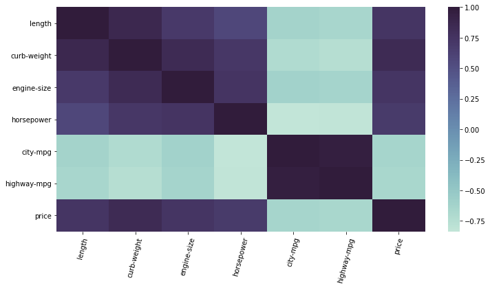
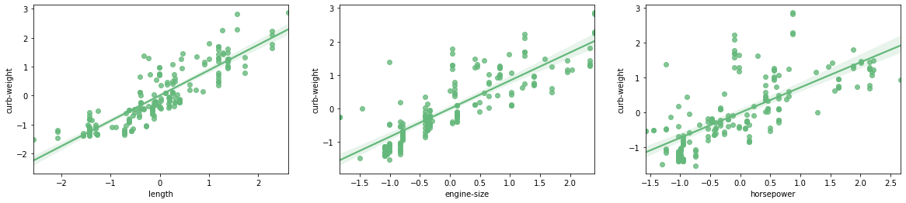
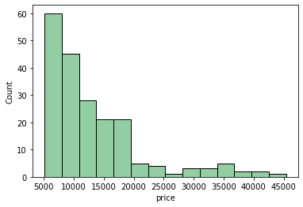
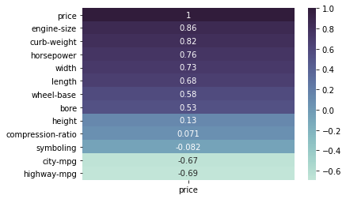
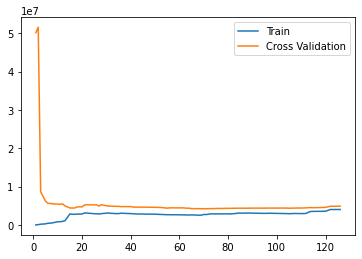
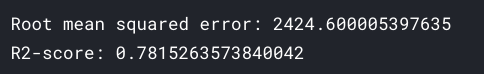
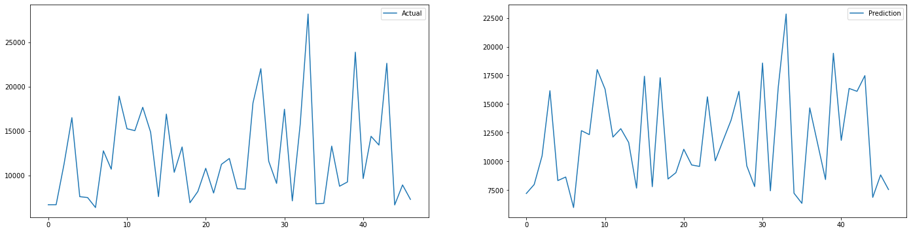
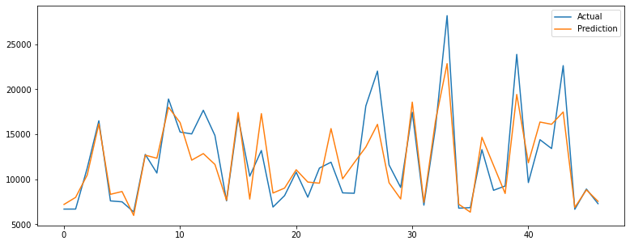

# predict-prices-of-vehicles

Here [vehicle_prices](https://www.kaggle.com/akashsdas/vehicle-prices) is used to perform `EDA`, find features by `feature engineering` that affects `price` of vehicles and create a `regression` model that can predict price of vechicles.

**While doing this we'll go through**

- Feature engineering on `categorical` and `continuous` features
- Dealing with `multi-collinearity` issues
- Dealing with `outliers`

## Table of contents

- [Getting started](#getting-started)
- [Findings](#findings)
- [Model performance](#model-performance)
- [License](#license)

## Getting started

The [notebook](https://www.kaggle.com/akashsdas/predict-prices-of-vehicles) is available on Kaggle to work in the same environment where this notebook was created i.e. use the same version packages used, etc...

## Findings

**Correlation matrix**

**Multi collinearity issue**

**Price distribution**

**Correlation matrix for vehicle prices**

To see more go to the [notebook](./notebook.ipynb).

## Model performance

**Learning curve**

**RMS error and R2 square metrics**

**Actual Vs Predicted values**

## License

[APACHE LICENSE, VERSION 2.0](./LICENSE)
